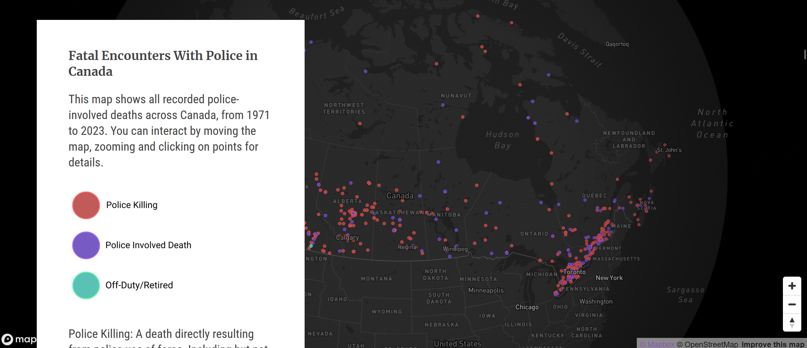
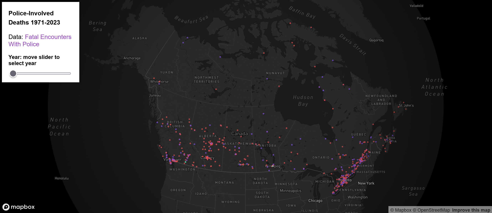
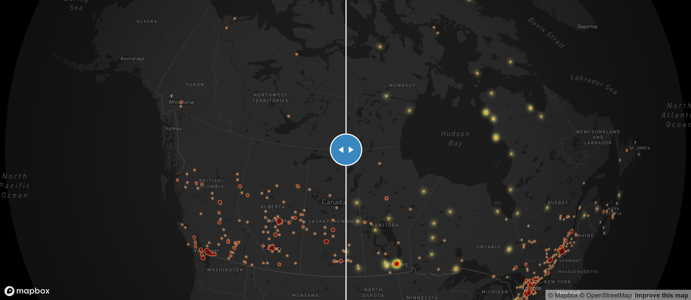
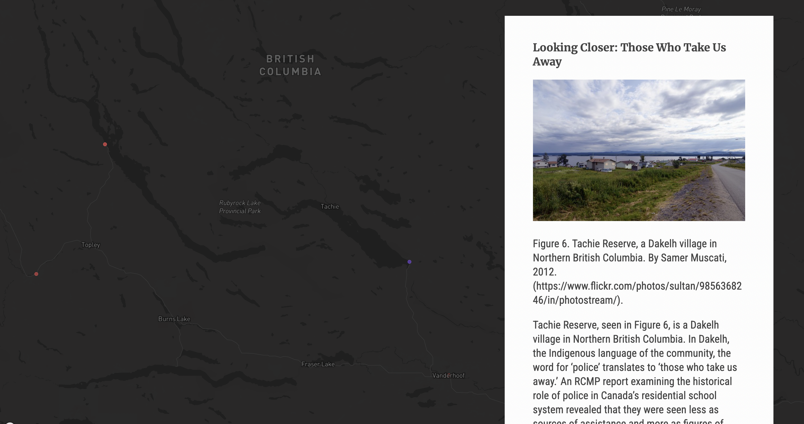
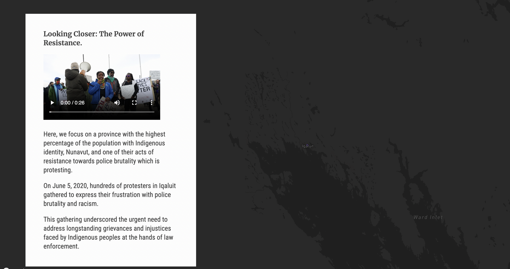

### Group 4 Final Project
# Mapping Police Violence: Unveiling Patterns and Disparities in Policing Practices Across Canada.

View storymap here: 

https://ubc-geos472-spring2024.github.io/Group4_Final_Project/Final_Project/index.html

Individual URL Links to HTML's:

https://ubc-geos472-spring2024.github.io/Group4_Final_Project/Final_Project/data/time_slider.html

https://ubc-geos472-spring2024.github.io/Group4_Final_Project/Final_Project/data/slider_ethnicity.html

https://ubc-geos472-spring2024.github.io/Group4_Final_Project/Final_Project/data/low_income_prevalence.html

